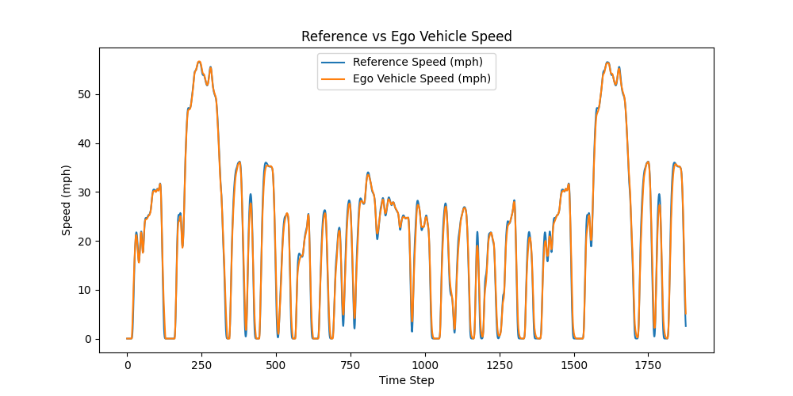
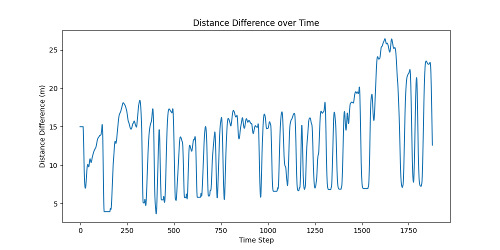
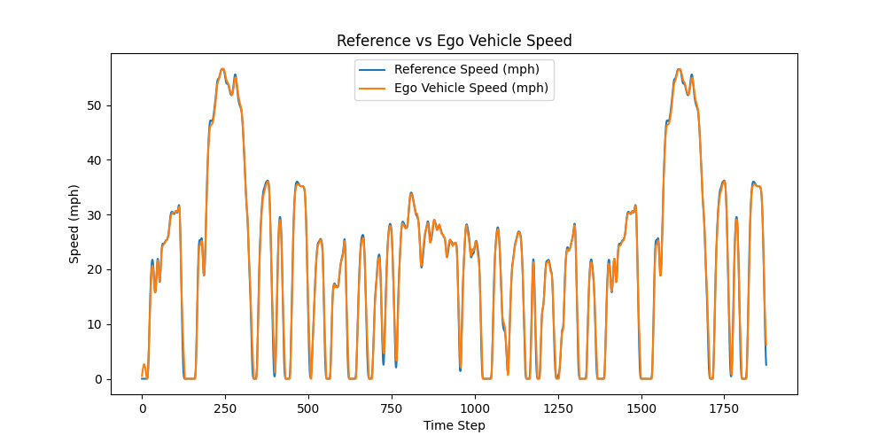
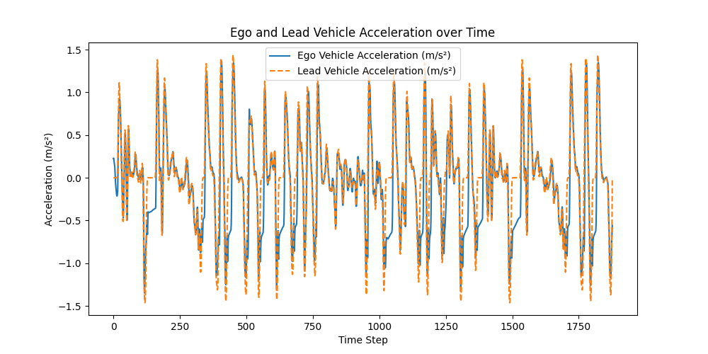

# ACC RL Simulator

This project is an adaptive cruise control (ACC) simulator built around real lead-vehicle driving profiles. It started with a classical jerk-limited PID baseline, and I later expanded it to include reinforcement learning-based control and experiment tracking for energy-aware electric vehicle following.
This project is also related to my broader research on energy-aware adaptive cruise control for electric vehicles. In particular, it connects to the same general problem setting as my IEEE OJITS paper on energy optimization in automated EVs. 
Although the representative folders currently shown in the repo focus on SAC examples, the broader experiment set also included DDPG and TD3 under different packet error rates and episode lengths.

The main idea is to compare how a classical ACC controller and learned RL policies behave under the same longitudinal vehicle dynamics, spacing constraints, and scenario inputs.

At this point, the repo includes:
- a discrete-time longitudinal vehicle simulation,
- real drive-cycle scenario loading from CSV files,
- a jerk-limited PID baseline,
- RL training and evaluation code,
- trained model checkpoints for representative SAC experiment settings,
- and result plots for tracking, spacing, acceleration, jerk, and cumulative energy behavior.

---

## Project Goal

The goal of this project is to build an ACC simulation framework where:
- the lead vehicle follows a real speed profile,
- the ego vehicle is controlled either by a classical baseline or an RL policy,
- and both controllers can be evaluated on the same scenario using the same vehicle dynamics.

More broadly, I wanted this repo to support side-by-side comparison between:
1. a classical control baseline,
2. and learning-based ACC policies trained under the same environment setup.

On top of basic car-following behavior, I also wanted to include energy-related behavior for electric vehicles, so the RL side is not only about tracking the lead car, but also about how the controller behaves from an energy point of view.

---

## What is currently in the repo

### Classical baseline side
The baseline ACC part includes:
- real drive-cycle loading from CSV,
- lead-vehicle position propagation from measured speed traces,
- a longitudinal ego-vehicle model,
- a jerk-limited PID-style cascade controller,
- and rollout plots for tracking and spacing behavior.

### RL side
The RL side includes:
- SAC training code integrated into the repo structure,
- evaluation code for replaying a trained policy on a full drive profile,
- an energy-aware environment setup for EV longitudinal control,
- representative trained SAC checkpoints,
- and representative result folders with training curves and rollout plots.

I also ran broader experiments across:
- DDPG, SAC, and TD3,
- packet error rates of 0.1, 0.5, and 0.9,
- and episode lengths of 100, 200, 250, and 300.

I did not want to dump the full archive into the repo, so for now I kept a smaller representative subset of models and results.

---
## Representative Results

Below are a few representative rollout plots from the RL-based adaptive cruise control experiments.

### SAC on FTP-75, episode length 200, packet error rate 10%

**Reference vs ego speed**


**Distance difference**


### SAC on FTP-75, episode length 250, packet error rate 50%

**Reference vs ego speed**


**Acceleration comparison**


For more rollout plots and training summary files, see [results/README.md](results/README.md).
## Repository Structure

---
pip install -r requirements.txt #For installing dependencies

```text
acc-rl-simulator/
├── app/
│   └── streamlit_app.py
├── assets/
├── controllers/
│   ├── pid_controller.py
│   └── rl_controller.py
├── env/
│   ├── acc_env.py
│   └── energy_model.py
├── evaluation/
│   ├── simulate.py
│   └── evaluate_sac.py
├── scenarios/
│   ├── real/
│   │   ├── FTP75.csv
│   │   ├── MetroHighwayCal.csv
│   │   └── NRELClassElectricVehicleCycle.csv
│   └── data_utils.py
├── training/
│   └── train_sac.py
├── models/
├── results/
├── requirements.txt
├── .gitignore
└── README.md
