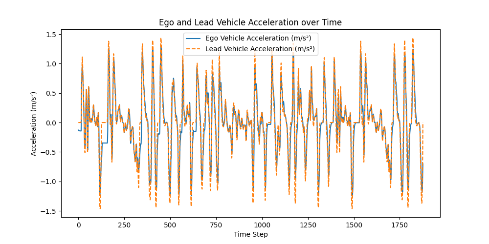
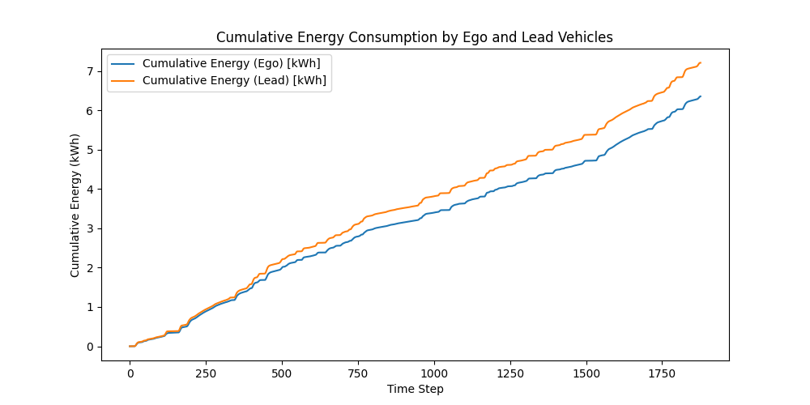
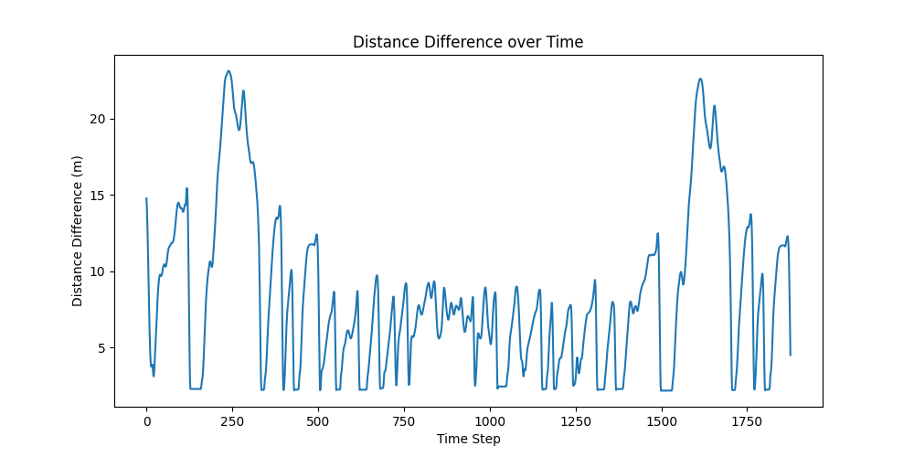
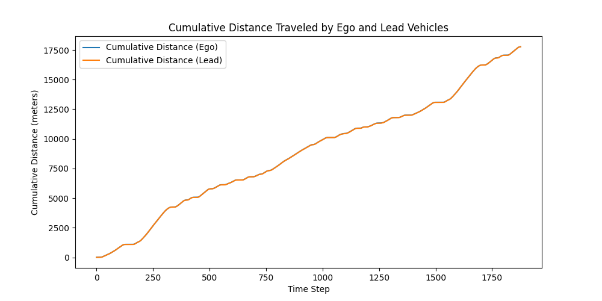

# Results

This folder contains representative training and evaluation plots for the RL-based adaptive cruise control experiments in this repo.

I wanted the repo to show not only the code, but also what the learned controller actually does during rollout on a driving profile.

Right now, I included two main FTP-75 SAC result sets:

- `ftp75_sac_ep200_per10/`
- `ftp75_sac_ep250_per50/`

These folders include rollout plots for:
- speed tracking
- spacing behavior
- acceleration comparison
- cumulative distance / cumulative energy

There are also combined training plots in this folder for actor loss, critic loss, and training/evaluation reward.

---

## SAC on FTP-75 — episode length 200, PER = 10%

### Reference vs ego speed

### Distance difference

### Acceleration comparison

### Cumulative energy

### Training summary files
- [Actor loss (5 seeds)](actor_loss_combined_5_seeds_per(10%)_200.pdf)
- [Critic loss (5 seeds)](critic_loss_combined_5_seeds_per(10%)_200.pdf)
- [Training / eval reward (5 seeds)](training_eval_combined_5_seeds_per(10%)_200.pdf)

---

## SAC on FTP-75 — episode length 250, PER = 50%

### Reference vs ego speed

### Distance difference

### Acceleration comparison

### Cumulative distance

### Training summary files
- [Actor loss (10 seeds)](actor_loss_combined_10_seeds_per(50%)_250.pdf)
- [Critic loss (10 seeds)](critic_loss_combined_10_seeds_per(50%)_250.pdf)
- [Training / eval reward (10 seeds)](training_eval_combined_10_seeds_per(50%)_250.pdf)

---

## Note

I generated more plots across different algorithms, packet-loss settings, episode lengths, and test cases, but I kept this folder focused on a smaller representative subset so the repo stays readable.
